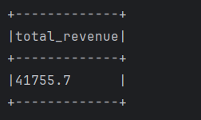
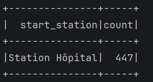
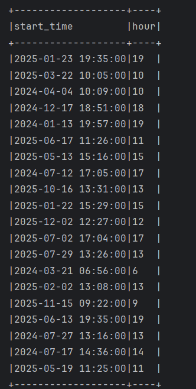
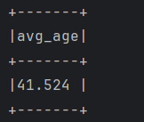
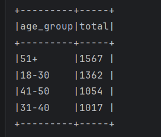

# TP 3 - Spark SQL : Analyse de données de location de vélos

> **Réalisé par** : NACIF Najlaa  

> **Module** : Big Data — MII BDCC  

> **École** : ENSET  

> **Encadrant** : Pr. Bouselham

---

## Description

Application Java/Spark SQL qui analyse un dataset de **5 000 locations de vélos** en libre-service. Le projet couvre le chargement de données CSV, la création de vues temporaires SQL, et plusieurs catégories d'analyses : filtrage, agrégation, analyse temporelle et comportement utilisateur.

---

## Architecture

```
TP 3 - SPARK SQL/
├── src/main/java/ma/enset/
│   └── SparkSQLApp.java       # Application principale
├── resources/
│   └── screenshots/                # Captures des résultats
├── rentals.csv                # Dataset (5 000 enregistrements)
├── docker-compose.yaml        # Cluster Spark (master + worker)
└── pom.xml                    # Dépendances Maven
```

---

## Stack technique

| Composant        | Version  |
|------------------|----------|
| Apache Spark     | 4.1.1    |
| Scala (bindings) | 2.13     |
| Java             | 17       |
| Maven            | 3.x      |
| Docker           | —        |

---

## Dataset — `rentals.csv`

Le fichier contient 5 000 enregistrements de locations avec le schéma suivant :

| Colonne            | Type      | Description                     |
|--------------------|-----------|---------------------------------|
| `rental_id`        | integer   | Identifiant unique de la location |
| `user_id`          | string    | Identifiant utilisateur          |
| `age`              | integer   | Âge de l'utilisateur             |
| `gender`           | string    | Genre (M / F / Autre)            |
| `start_time`       | timestamp | Heure de début                   |
| `end_time`         | timestamp | Heure de fin                     |
| `start_station`    | string    | Station de départ                |
| `end_station`      | string    | Station d'arrivée                |
| `duration_minutes` | integer   | Durée en minutes                 |
| `price`            | double    | Prix en MAD                      |

**Schéma inféré automatiquement par Spark :**


**Aperçu des 5 premières lignes :**


**Nombre total de locations : 5 000**


---

## Lancement

### Prérequis

- Docker & Docker Compose installés
- Maven 3.x
- Java 17

### 1. Compiler le projet

```bash
mvn clean package
```

Cela génère `target/spark-sql-app.jar`.

### 2. Démarrer le cluster Spark

```bash
docker-compose up -d
```

| Service       | URL                        |
|---------------|----------------------------|
| Spark Master  | http://localhost:8080       |
| Spark Worker  | http://localhost:8081       |

### 3. Soumettre l'application

```bash
docker exec spark-master /opt/spark/bin/spark-submit \
  --master spark://spark-master:7077 \
  /opt/spark-apps/target/spark-sql-app.jar
```

---

## Analyses réalisées

### 1. Chargement et exploration

Lecture du CSV avec inférence de schéma, affichage des 5 premières lignes et comptage total.

```java
Dataset<Row> bikeRentals = ss.read()
    .option("header", true)
    .option("inferSchema", true)
    .csv("/opt/spark-apps/rentals (1).csv");

bikeRentals.createOrReplaceTempView("bike_rentals_view");
```

---

### 2. Requêtes SQL de base

#### Locations de plus de 30 minutes

```sql
SELECT * FROM bike_rentals_view WHERE duration_minutes > 30
```


#### Revenu total

```sql
SELECT sum(price) AS total_revenue FROM bike_rentals_view
```



**Revenu total : 41 755.7 MAD**

---

### 3. Agrégations par station

#### Nombre de locations par station de départ

```sql
SELECT start_station, count(*) AS nb_rentals
FROM bike_rentals_view
GROUP BY start_station
```


#### Durée moyenne par station de départ

```sql
SELECT start_station, avg(duration_minutes) AS avg_duration
FROM bike_rentals_view
GROUP BY start_station
```


#### Station avec le plus grand nombre de locations

```sql
SELECT start_station, count(*) AS nb_rentals
FROM bike_rentals_view
GROUP BY start_station
ORDER BY nb_rentals DESC LIMIT 1
```



**Station Hôpital arrive en tête avec 447 locations.**

---

### 4. Analyse temporelle

#### Extraction de l'heure depuis `start_time`

```sql
SELECT *, hour(start_time) AS start_hour FROM bike_rentals_view
```



#### Nombre de locations par heure (heures de pointe)

```sql
SELECT hour(start_time) AS start_hour, count(*) AS nb_rentals
FROM bike_rentals_view
GROUP BY hour(start_time)
ORDER BY start_hour
```


**Heure de pointe : 19h avec 507 locations**


#### Station la plus populaire le matin (7h–12h)

```sql
SELECT start_station, count(*) AS nb_rentals
FROM bike_rentals_view
WHERE hour(start_time) >= 7 AND hour(start_time) < 12
GROUP BY start_station
ORDER BY nb_rentals DESC LIMIT 1
```


**Station Technopark est la plus fréquentée le matin avec 207 locations.**

---

### 5. Comportement utilisateur

#### Âge moyen des utilisateurs

```sql
SELECT avg(age) AS avg_age FROM bike_rentals_view
```



**Âge moyen : 41.5 ans**

#### Répartition par genre

```sql
SELECT gender, count(*) AS nb_users
FROM bike_rentals_view
GROUP BY gender
```


| Genre | Nombre |
|-------|--------|
| M     | 2 542  |
| F     | 2 286  |
| Autre | 172    |

#### Locations par tranche d'âge

```sql
SELECT
  CASE
    WHEN age BETWEEN 18 AND 30 THEN '18-30'
    WHEN age BETWEEN 31 AND 40 THEN '31-40'
    WHEN age BETWEEN 41 AND 50 THEN '41-50'
    ELSE '51+'
  END AS age_group,
  count(*) AS nb_rentals
FROM bike_rentals_view
GROUP BY age_group
ORDER BY nb_rentals DESC
```



| Tranche d'âge | Locations |
|---------------|-----------|
| 51+           | 1 567     |
| 18–30         | 1 362     |
| 41–50         | 1 054     |
| 31–40         | 1 017     |

---

## Résultats clés

| Indicateur                        | Valeur               |
|-----------------------------------|----------------------|
| Nombre total de locations         | 5 000                |
| Revenu total                      | 41 755.7 MAD         |
| Station la plus active            | Station Hôpital (447)|
| Station matin la plus active      | Station Technopark (207) |
| Heure de pointe                   | 19h (507 locations)  |
| Âge moyen des utilisateurs        | 41.5 ans             |
| Tranche d'âge dominante           | 51+ (1 567)          |
