# Réalisé par : Khalid AIT M'HAMED

**Encadré par :** Abdelmajid BOUSSELHAM

**Université :** ENSET Mohammedia

**Module :** Big Data

---

# TP5 — Traitement de Flux avec Kafka Streams

Ce projet implémente trois exercices de traitement de flux en temps réel avec **Apache Kafka Streams**, couvrant le nettoyage de texte, l'analyse météorologique avec métriques Prometheus, et le comptage de clics utilisateurs via une architecture multi-applications Spring Boot.

---

## Table des matières

- [Infrastructure](#infrastructure)
- [Exercice 1 — Text Cleaner](#exercice-1--text-cleaner)
- [Exercice 2 — Weather Analyzer](#exercice-2--weather-analyzer)
- [Exercice 3 — Click Stream Analytics](#exercice-3--click-stream-analytics)
- [Technologies utilisées](#technologies-utilisées)

---

## Infrastructure

L'ensemble du projet s'appuie sur un broker Kafka démarré via Docker Compose avec les composants suivants :

| Composant    | Image                              | Port  |
|--------------|------------------------------------|-------|
| Zookeeper    | `confluentinc/cp-zookeeper:7.5.0`  | 2181  |
| Kafka Broker | `apache/kafka:latest`              | 9092  |

Le broker est configuré en mode KRaft/KIP-500 avec un nœud unique jouant à la fois le rôle de `broker` et de `controller`.

```bash
docker-compose up -d
```

---

## Exercice 1 — Text Cleaner

### Description

`TextCleanerApp` est une application Kafka Streams pure (sans Spring Boot) qui consomme des messages texte bruts, les nettoie et les trie en deux catégories : messages valides et messages rejetés.

### Topics Kafka

| Topic              | Rôle                                           |
|--------------------|------------------------------------------------|
| `text-input`       | Topic source — reçoit les messages texte bruts |
| `text-clean`       | Topic de destination — messages valides        |
| `text-dead-letter` | Topic de rejet — messages invalides            |

La liste complète des topics créés est visible ci-dessous :

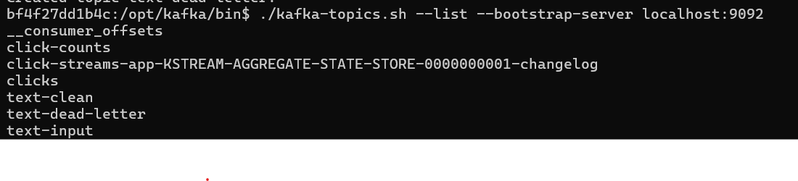

### Pipeline Kafka Streams

Le flux de traitement suit 5 étapes successives :

```
text-input
    │
    ▼
mapValues()       → trim() + replaceAll("\\s+", " ") + toUpperCase()
    │
    ▼
filter(isValid)   → longueur ≤ 100 chars, pas vide, sans mots interdits
    │
    ├──── VALIDE ──────────────► text-clean
    │
    └──── INVALIDE ────────────► text-dead-letter
```

**Règles de validation (`isValid`) :**
- La valeur ne doit pas être `null` ni vide
- La longueur ne doit pas dépasser **100 caractères**
- La valeur ne doit pas contenir les mots interdits : `HACK`, `SPAM`, `XXX`

### Données d'entrée

Le producer console envoie trois messages vers le topic `text-input` :

```
hello world
this is spam message
kafka streams
```

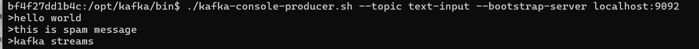

### Résultats

Le consumer console écoute le topic `text-clean` et reçoit uniquement les messages valides, transformés en majuscules :

- `"hello world"` → nettoyé et validé → **`HELLO WORLD`**
- `"this is spam message"` → contient `SPAM` → **rejeté vers `text-dead-letter`**
- `"kafka streams"` → nettoyé et validé → **`KAFKA STREAMS`**

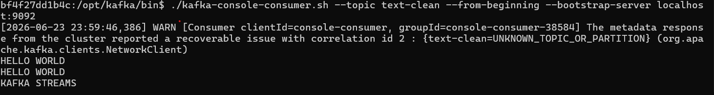

> Le message contenant "spam" a bien été filtré et redirigé vers `text-dead-letter`, confirmant le bon fonctionnement de la validation.

### Configuration de l'application

| Propriété             | Valeur             |
|-----------------------|--------------------|
| `application.id`      | `text-cleaner-app` |
| `bootstrap.servers`   | `localhost:9092`   |
| `default.key.serde`   | `StringSerde`      |
| `default.value.serde` | `StringSerde`      |

---

## Exercice 2 — Weather Analyzer

### Description

`WeatherAnalyzerApp` est une application Kafka Streams qui consomme des données météorologiques brutes, filtre les températures élevées, convertit les unités, agrège les mesures par station, et expose des métriques en temps réel via **Prometheus**.

### Topics Kafka

| Topic              | Rôle                                                 |
|--------------------|------------------------------------------------------|
| `weather-data`     | Topic source — données météo brutes au format CSV    |
| `station-averages` | Topic de destination — moyennes calculées par station |

Les topics sont créés automatiquement au démarrage via l'`AdminClient` Kafka.

### Format des données d'entrée

Chaque message dans `weather-data` suit le format CSV :

```
station,température_celsius,humidité
```

### Données d'entrée

Le producer console envoie les données météo vers le topic `weather-data` :

```
station1,35,70
station1,40,80
station2,32,60
station2,36,65
```

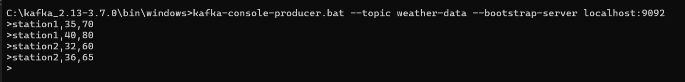

### Pipeline Kafka Streams

Le traitement s'effectue en 7 étapes :

```
weather-data
    │
    ▼
mapValues(parse)          → Parsing CSV : station, température (°C), humidité
filter(v != null)         → Rejet des messages malformés
    │
    ▼
filter(temp > 30°C)       → Filtrage : seules les temp. > 30°C sont conservées
    │
    ▼
mapValues(convert)        → Conversion Celsius → Fahrenheit : (C × 9/5) + 32
selectKey(station)        → Re-clé par nom de station
    │
    ▼
groupByKey()              → Regroupement par station
    │
    ▼
aggregate()               → Accumulation : somme températures, humidités, compteur
    │
    ▼
toStream().mapValues()    → Formatage : "station : Temp moyenne = X F, Humidité = Y %"
    │
    ▼
station-averages
```

**Formule de conversion :**
```
Fahrenheit = (Celsius × 9 / 5) + 32
```

**Formule des moyennes :**
```
avgTemp     = tempSum / count
avgHumidity = humiditySum / count
```

### Vérification des calculs

| Station  | Temp. entrées (°C) | Temp. (°F)    | Moy. Temp (°F) | Humidités | Moy. Humidité |
|----------|--------------------|---------------|----------------|-----------|----------------|
| station1 | 35, 40             | 95.0, 104.0   | **99.5 F**     | 70, 80    | **75.0 %**     |
| station2 | 32, 36             | 89.6, 96.8    | **93.2 F**     | 60, 65    | **62.5 %**     |

### Résultats

Le consumer console sur `station-averages` affiche les moyennes calculées par station :

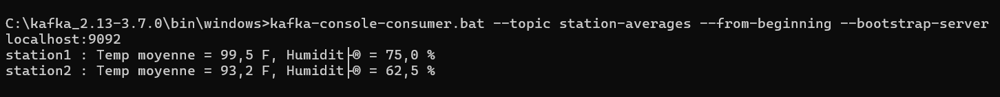

Les résultats correspondent exactement aux calculs attendus : station1 à **99,5 F / 75,0 %** et station2 à **93,2 F / 62,5 %**.

### Architecture globale — Vue d'exécution

La capture ci-dessous montre l'ensemble du système en fonctionnement simultané : producer, streams app, consumer et liste des topics :

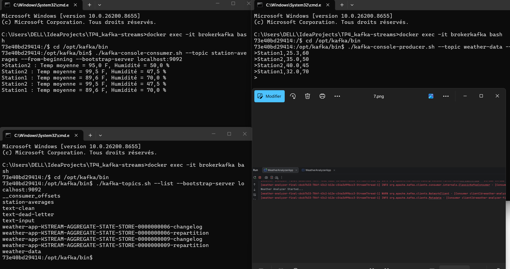

### Métriques Prometheus

L'application expose deux métriques sur le port **1234** (`http://localhost:1234/metrics`) :

| Métrique                              | Type  | Description                          |
|---------------------------------------|-------|--------------------------------------|
| `weather_avg_temperature_fahrenheit`  | Gauge | Température moyenne par station (°F) |
| `weather_avg_humidity`                | Gauge | Humidité moyenne par station (%)     |

Les métriques sont étiquetées par station (`label: station`) et mises à jour en temps réel à chaque agrégation. Le serveur HTTP Prometheus est démarré via `DefaultExports.initialize()` et `new HTTPServer(1234)`.

### Modèles de données internes

**`WeatherData`** : Représente une mesure météo (`station`, `temperature`, `humidity`).

**`StationAggregate`** : Accumule les données d'une station (`tempSum`, `humiditySum`, `count`). Sérialisé via des `Serde` personnalisés au format CSV interne.

### Configuration de l'application

| Propriété             | Valeur                   |
|-----------------------|--------------------------|
| `application.id`      | `weather-analyzer-final` |
| `bootstrap.servers`   | `localhost:9092`         |
| `auto.offset.reset`   | `earliest`               |
| Port Prometheus        | `1234`                   |

---

## Exercice 3 — Click Stream Analytics

### Description

L'exercice 3 implémente une architecture micro-services complète en **3 applications indépendantes** :

1. **Producer App** (Spring Boot — port 8082) : Interface web permettant à l'utilisateur de cliquer pour envoyer des événements vers Kafka
2. **Kafka Streams App** : Agrège les clics en temps réel via Kafka Streams
3. **Consumer App** (Spring Boot — port 8083) : Consomme les compteurs et les expose via une API REST

### Architecture globale

```
Navigateur
    │  POST /click
    ▼
ClickProducerApp (:8082)
    │  KafkaTemplate → topic "clicks" (clé: "user1", valeur: "click")
    ▼
Topic: clicks
    │
    ▼
ClickStreamsApp
    │  groupByKey().count() → KTable<String, Long>
    │  toStream().mapValues(Long::toString)
    ▼
Topic: click-counts
    │
    ▼
ClickConsumerApp (:8083)
    │  @KafkaListener → ClickCountService (AtomicLong)
    ▼
REST API GET /clicks/count → {"totalClicks": N}
```

### Topics Kafka

| Topic                                                              | Rôle                                             |
|--------------------------------------------------------------------|--------------------------------------------------|
| `clicks`                                                           | Reçoit chaque événement de clic utilisateur      |
| `click-counts`                                                     | Contient le compteur mis à jour par Kafka Streams|
| `click-streams-app-KSTREAM-AGGREGATE-STATE-STORE-*-changelog`      | Topic interne de changelog RocksDB               |

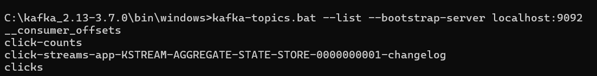

### Configuration et création des topics

Les topics `clicks` et `click-counts` sont créés manuellement (1 partition, réplication factor 1). La capture montre la confirmation de leur existence :

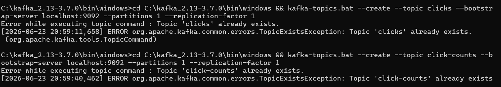

---

### Application 1 — Producer (ClickProducerApp)

**Port :** 8082 | **Profil Spring :** `producer`

| Endpoint      | Méthode | Action                                                         |
|---------------|---------|----------------------------------------------------------------|
| `GET /`       | GET     | Affiche l'interface web (Thymeleaf)                            |
| `POST /click` | POST    | Envoie `"click"` vers le topic `clicks` (clé : `"user1"`)     |

**Configuration (`application-producer.properties`) :**
```properties
server.port=8082
spring.application.name=click-producer-app
spring.kafka.producer.key-serializer=StringSerializer
spring.kafka.producer.value-serializer=StringSerializer
```

#### Interface utilisateur

L'interface web (Thymeleaf + JavaScript) affiche un bouton. Chaque clic déclenche un appel `POST /click` en Ajax et incrémente un compteur local affiché à l'écran :

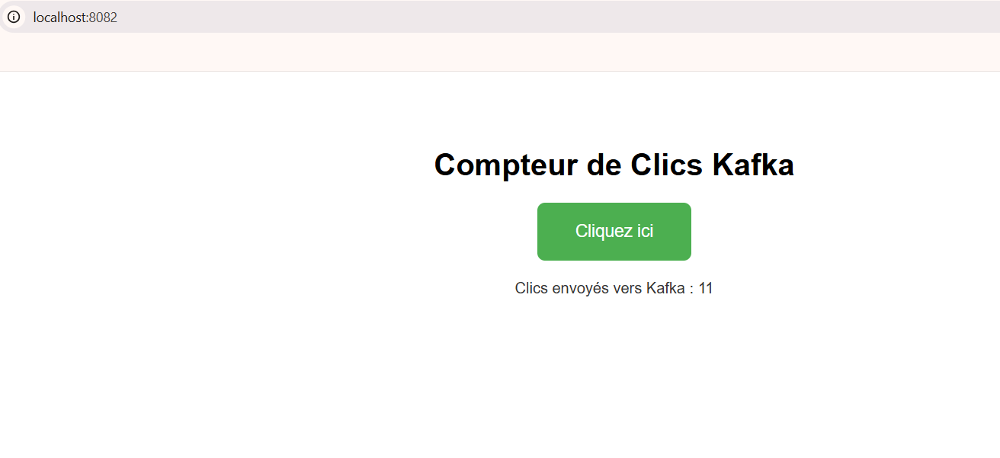

Chaque clic sur "Cliquez ici" envoie un message `"click"` avec la clé `"user1"` vers le topic Kafka `clicks`.

---

### Application 2 — Kafka Streams (ClickStreamsApp)

**Application ID :** `click-streams-app`

#### Démarrage de l'application Streams

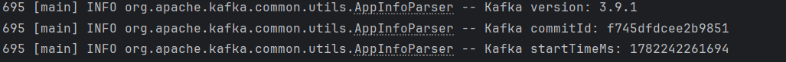

L'application démarre avec Kafka Streams version **3.9.1**.

#### Pipeline Kafka Streams

```
Topic: clicks
    │
    ▼
builder.stream("clicks")          → KStream<String, String>
    │
groupByKey()                      → KGroupedStream<String, String>
    │
count()                           → KTable<String, Long>  [State Store RocksDB]
    │
toStream().mapValues(Long::toString)
    │
    ▼
Topic: click-counts               → valeur = compteur sous forme de String
```

Le `groupByKey()` regroupe les messages par clé (`"user1"`). `count()` incrémente un compteur persistant dans un **state store RocksDB** (`KSTREAM-AGGREGATE-STATE-STORE-0000000001`) à chaque nouveau message reçu. Le résultat est committé toutes les **1000 ms**.

**Configuration spécifique :**
```properties
state.dir=./kafka-streams-state
commit.interval.ms=1000
auto.offset.reset=earliest
```

#### Données reçues dans le topic `clicks`

Chaque clic utilisateur génère un message `"click"` dans le topic `clicks` :

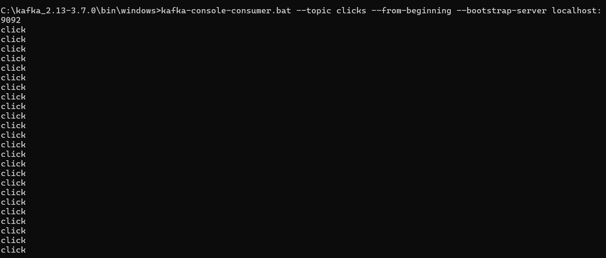

---

### Application 3 — Consumer (ClickConsumerApp)

**Port :** 8083 | **Profil Spring :** `consumer`

**Configuration (`application-consumer.properties`) :**
```properties
server.port=8083
spring.application.name=click-consumer-app
spring.kafka.consumer.group-id=click-consumer-group
spring.kafka.consumer.auto-offset-reset=earliest
spring.kafka.consumer.key-deserializer=StringDeserializer
spring.kafka.consumer.value-deserializer=StringDeserializer
```

**Composants :**

| Classe                 | Rôle                                                             |
|------------------------|------------------------------------------------------------------|
| `ClickKafkaListener`   | `@KafkaListener` sur `click-counts` — met à jour le service     |
| `ClickCountService`    | Stocke le compteur dans un `AtomicLong` thread-safe             |
| `ClickCountController` | Expose `GET /clicks/count` et `GET /clicks/test`                 |

#### Résultats Kafka Streams — compteurs dans `click-counts`

Le consumer console sur `click-counts` montre les compteurs croissants publiés par Kafka Streams :

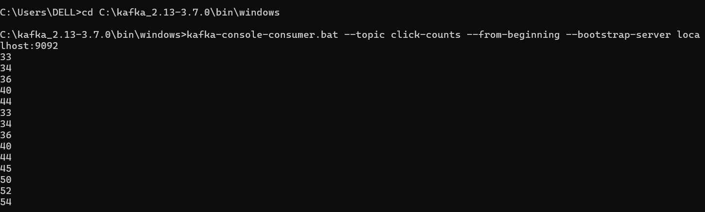

Les valeurs (33, 34, 36, 40, 44, 45, 50, 52, 54...) représentent le total cumulatif de clics par utilisateur (`"user1"`), mis à jour à chaque commit interval (toutes les **1000 ms**).

#### API REST — Résultat final

L'API REST du Consumer App expose le total des clics en temps réel :

```
GET http://localhost:8083/clicks/count
```

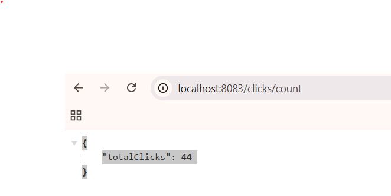

La réponse JSON `{"totalClicks": 44}` confirme que le Consumer App a bien reçu, via le `@KafkaListener`, le dernier compteur publié par Kafka Streams dans le topic `click-counts` et le stocke dans son `AtomicLong`.

---

### Flux complet de données — Récapitulatif

```
[Navigateur] → clic sur le bouton
      │
      ▼
[Producer :8082]  POST /click
      │  kafkaTemplate.send("clicks", "user1", "click")
      ▼
[Topic: clicks]   →  "click" / "click" / "click" / ...
      │
      ▼
[ClickStreamsApp]  groupByKey().count()
      │  State store RocksDB : user1 → 44
      │  toStream().mapValues("44")
      ▼
[Topic: click-counts]  →  user1 / "44"
      │
      ▼
[Consumer :8083]  @KafkaListener
      │  clickCountService.updateCount(44)
      ▼
[GET /clicks/count]  →  {"totalClicks": 44}
```

---

## Technologies utilisées

| Technologie             | Version | Rôle                                                    |
|-------------------------|---------|---------------------------------------------------------|
| Apache Kafka            | 3.9.1   | Broker de messages distribué                            |
| Kafka Streams           | 3.9.1   | Bibliothèque de traitement de flux                      |
| Spring Boot             | 3.2.5   | Framework applicatif (Exercice 3)                       |
| Spring Kafka            | —       | Intégration Kafka pour Spring (Producer + Consumer)     |
| Thymeleaf               | —       | Moteur de templates HTML (interface web Exercice 3)     |
| Prometheus Java Client  | 0.16.0  | Exposition de métriques (Exercice 2)                    |
| RocksDB                 | —       | State store persistant pour Kafka Streams               |
| Docker / Docker Compose | —       | Déploiement de l'infrastructure Kafka + Zookeeper       |
| Java                    | 17      | Langage de développement                                |
| Maven                   | —       | Gestion des dépendances et build                        |

---

## Structure du projet

```
TP5_kafka-streams/
├── docker-compose.yml
├── pom.xml
├── screenshots/
│   ├── ex1.1.png              # Topics Kafka — Exercice 1
│   ├── EX1.2.png              # Producer text-input — Exercice 1
│   ├── ex1.3.png              # Consumer text-clean — Exercice 1
│   ├── ex2.1.png              # Producer weather-data — Exercice 2
│   ├── ex2.2.png              # Consumer station-averages — Exercice 2
│   ├── ex2.3.png              # Vue globale — Exercice 2
│   ├── ex3.1.png              # Topics Kafka — Exercice 3
│   ├── ex3.2.png              # Création des topics — Exercice 3
│   ├── ex3.3.png              # Consumer topic clicks — Exercice 3
│   ├── ex3.4.png              # Interface web Producer — Exercice 3
│   ├── e3.5.png               # Consumer topic click-counts — Exercice 3
│   ├── ex3.6.png              # API REST /clicks/count — Exercice 3
│   └── ex3.7.png              # Logs démarrage ClickStreamsApp — Exercice 3
└── src/main/java/ma/rafik/
    ├── exercice1/
    │   └── TextCleanerApp.java
    ├── exercice2/
    │   └── WeatherAnalyzerApp.java
    └── exercice3/
        ├── producer/
        │   ├── ClickProducerApp.java
        │   └── ClickController.java
        ├── streams/
        │   └── ClickStreamsApp.java
        └── consumer/
            ├── ClickConsumerApp.java
            ├── ClickKafkaListener.java
            ├── ClickCountService.java
            └── ClickCountController.java
```
