**Réalisé par :** NACIF Najlaa

**Encadré par :** Abdelmajid BOUSSELHAM  
**Université :** ENSET Mohammedia  
**Filière :** II-BDDC  
**Module :** Big Data  
**Outils :** Docker, Docker Compose, Apache Airflow, PythonOperator  
**Année scolaire :** 2026  

---

## 1. Description du projet

Ce projet est un atelier pratique (TP6) réalisé dans le cadre du module **Big Data** à l'ENSET Mohammedia. Il porte sur l'orchestration de pipelines de données avec **Apache Airflow**, déployé via **Docker Compose**.

Apache Airflow est une plateforme d'orchestration de workflows. Il permet de définir, planifier, exécuter et surveiller des pipelines sous forme de DAGs. Il ne remplace pas les outils de traitement comme Spark, Hadoop ou Flink. Son rôle est de les coordonner dans un pipeline cohérent et automatisé.

---

## 2. Objectifs de l'atelier

À la fin de cet atelier, nous devons être capables de :

- comprendre le rôle d'Apache Airflow dans les pipelines Big Data
- expliquer ce qu'est un DAG
- créer un pipeline simple avec plusieurs tâches
- utiliser PythonOperator pour exécuter des fonctions Python
- simuler les étapes d'un pipeline Big Data
- définir l'ordre d'exécution des tâches
- exécuter un DAG depuis l'interface Web
- consulter les logs d'une tâche
- comprendre la planification automatique
- comprendre la gestion des erreurs et des reprises
- créer des dépendances parallèles dans un DAG
- expliquer pourquoi Airflow est important dans une architecture Data Engineering

---

## 3. Architecture du projet

```
TP6_Big Data Apache Airflow/
│
├── dags/
│   ├── mon_premier_dag.py
│   ├── pipeline_big_data_python.py
│   ├── pipeline_big_data_parallele.py
│   └── pipeline_inscription_etudiants.py
│
├── data/
│   ├── ventes_raw.csv
│   ├── ventes_clean.csv
│   ├── resultats_ventes.json
│   └── rapport_pipeline.txt
│
├── logs/
├── plugins/
└── docker-compose.yml
```

| Dossier | Rôle |
|---|---|
| `dags/` | Contient les fichiers Python des DAGs. Airflow surveille ce dossier automatiquement. |
| `data/` | Contient les fichiers de données manipulés par les DAGs. Monté en volume Docker sur `/opt/airflow/data`. |
| `logs/` | Contient les logs d'exécution générés automatiquement, organisés par DAG, run et tâche. |
| `plugins/` | Contient les extensions personnalisées. Non utilisé dans ce TP. |
| `docker-compose.yml` | Configure les trois services Docker : `postgres`, `airflow-webserver` et `airflow-scheduler`. |

---

## 4. Lancement de l'environnement

**Démarrer Airflow :**
```bash
docker compose up -d
```

**Vérifier les conteneurs actifs :**
```bash
docker ps
```

**Accéder à l'interface Web :**
```
http://localhost:8080
Identifiants : airflow / airflow
```

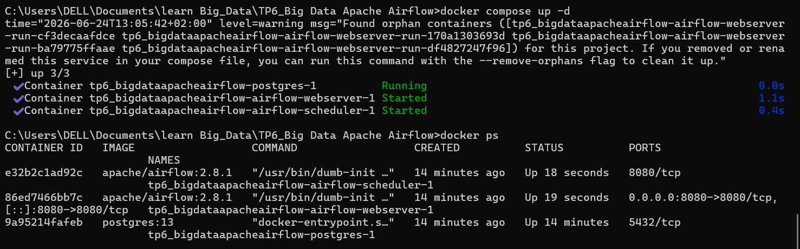

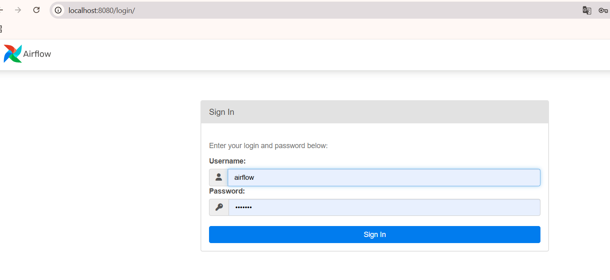

---

## 5. Description des DAGs

### 5.1 Premier DAG : `mon_premier_dag`

**Fichier :** `dags/mon_premier_dag.py`  
**Tags :** `initiation`, `python-operator`  
**Schedule :** `None` (déclenchement manuel)

Ce DAG contient trois tâches séquentielles. Son objectif est de comprendre comment Airflow organise les tâches avec PythonOperator.

```
debut  ──►  traitement  ──►  fin
```

| Tâche | Fonction appelée | Message affiché dans les logs |
|---|---|---|
| `debut` | `debut_pipeline()` | `Debut du pipeline Big Data` |
| `traitement` | `traitement_pipeline()` | `Traitement en cours` |
| `fin` | `fin_pipeline()` | `Fin du pipeline Big Data` |

Si les trois tâches sont vertes dans la vue Graph, cela signifie que le pipeline s'est exécuté correctement.  
Si une tâche est rouge, cela signifie qu'elle a échoué. Il faut alors consulter les logs pour comprendre l'erreur.

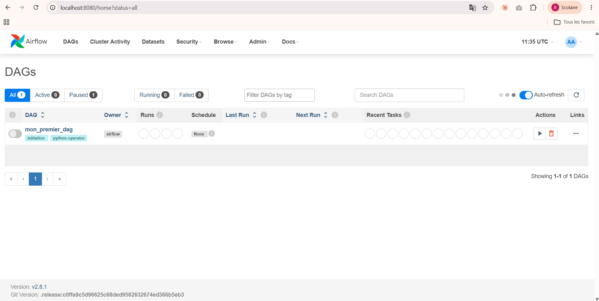

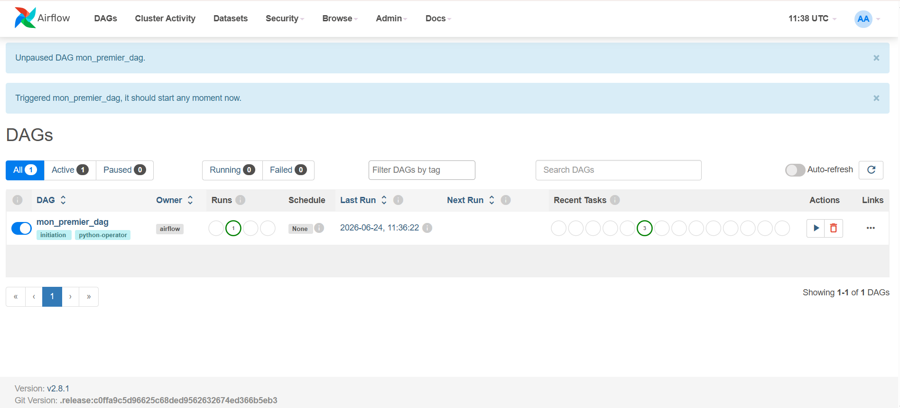

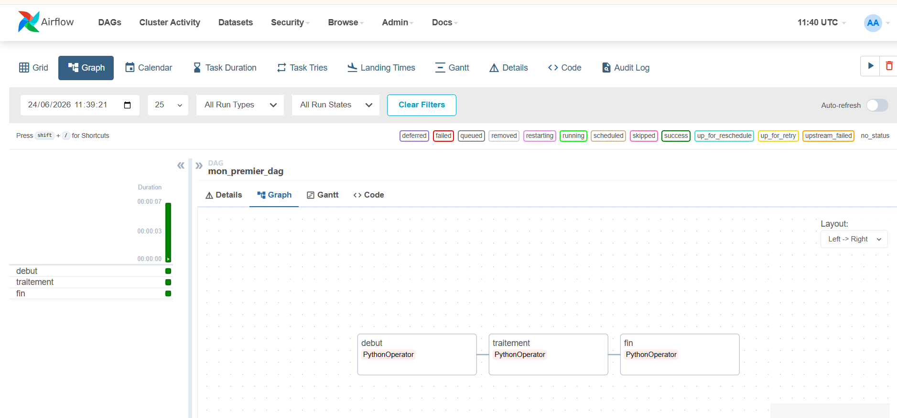

---

### 5.2 Deuxième DAG : `pipeline_big_data_python`

**Fichier :** `dags/pipeline_big_data_python.py`  
**Tags :** `big-data`, `python-operator`  
**Schedule :** `None` (modifié ensuite en `@daily`)

Ce DAG simule un pipeline Big Data classique en 7 étapes séquentielles.

```
ingestion_donnees
      │
      ▼
stockage_zone_brute
      │
      ▼
validation_donnees
      │
      ▼
transformation_donnees
      │
      ▼
traitement_analytique
      │
      ▼
chargement_resultats
      │
      ▼
generation_rapport
```

| Tâche | Rôle dans le pipeline Big Data |
|---|---|
| `ingestion_donnees` | Simule la récupération des données depuis une source externe. Crée le fichier `ventes_raw.csv`. |
| `stockage_zone_brute` | Simule le stockage dans une zone brute du Data Lake. Vérifie l'existence du fichier et affiche sa taille. |
| `validation_donnees` | Vérifie l'existence du fichier et la structure des colonnes. |
| `transformation_donnees` | Nettoie les données et calcule la colonne `montant = prix × quantité`. Produit `ventes_clean.csv`. |
| `traitement_analytique` | Calcule le chiffre d'affaires total par ville. Produit `resultats_ventes.json`. |
| `chargement_resultats` | Simule le chargement des résultats dans une base analytique. |
| `generation_rapport` | Génère le rapport final `rapport_pipeline.txt`. |

**Résultats produits :**

```json
{
    "Casablanca": 23500.0,
    "Rabat": 6100.0,
    "Marrakech": 1500.0,
    "Tanger": 8500.0
}
```

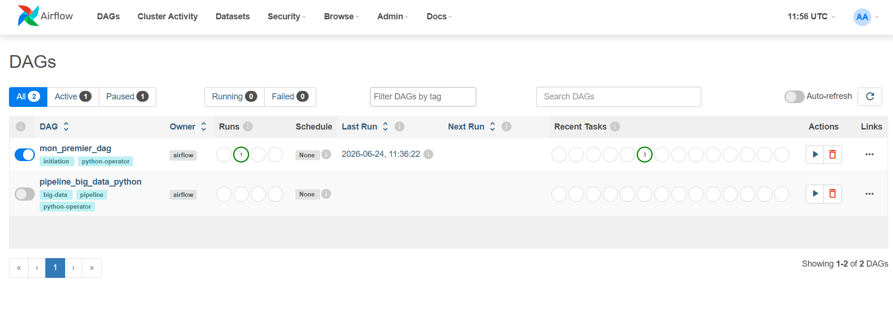

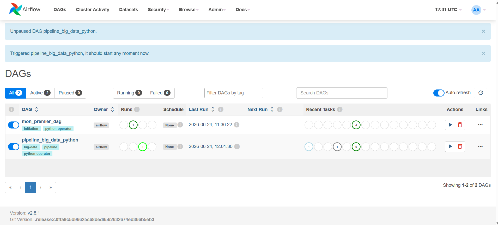

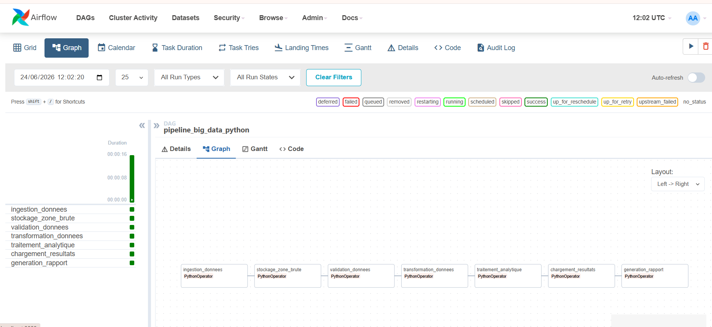

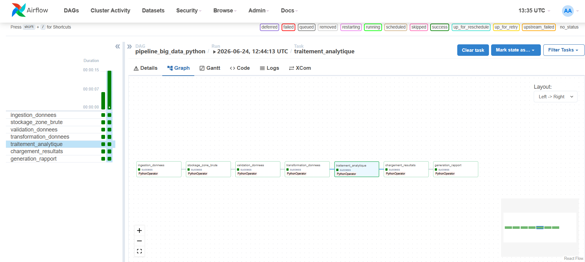

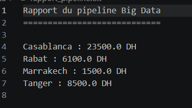

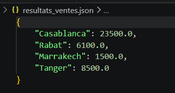

---

### 5.3 Troisième DAG : `pipeline_big_data_parallele`

**Fichier :** `dags/pipeline_big_data_parallele.py`  
**Tags :** `big-data`, `parallelisme`, `python-operator`  
**Schedule :** `None` (déclenchement manuel)

Ce DAG illustre l'exécution parallèle de deux tâches après une phase séquentielle.

```
preparation_donnees
        │
        ▼
validation_donnees
        │
   ┌────┴────┐
   ▼         ▼
traitement   traitement
_par_ville   _par_produit
   │         │
   └────┬────┘
        ▼
generation_rapport_final
```

| Tâche | Description |
|---|---|
| `preparation_donnees` | Génère le fichier `ventes_clean.csv` avec montant pré-calculé. |
| `validation_donnees` | Vérifie l'existence du fichier. |
| `traitement_par_ville` | Calcule le CA par ville → `resultat_par_ville.json` |
| `traitement_par_produit` | Calcule le CA par produit → `resultat_par_produit.json` |
| `generation_rapport_final` | Fusionne les deux résultats dans le rapport final. |

---

### 5.4 Mini-projet : `pipeline_inscription_etudiants`

**Fichier :** `dags/pipeline_inscription_etudiants.py`  
**Tags :** `mini-projet`, `python-operator`  
**Schedule :** `None` (déclenchement manuel)

Ce DAG simule le traitement automatisé des inscriptions des étudiants avec parallélisme entre l'affectation aux groupes et la génération des statistiques.

```
reception_fichier
        │
        ▼
stockage_zone_brute
        │
        ▼
validation_fichier
        │
        ▼
nettoyage_donnees
        │
   ┌────┴──────────────┐
   ▼                   ▼
affectation_       generation_
groupes            statistiques
   │                   │
   └─────────┬─────────┘
             ▼
        rapport_final
```

| Tâche | Message affiché dans les logs |
|---|---|
| `reception_fichier` | `Reception du fichier des etudiants` |
| `stockage_zone_brute` | `Stockage du fichier dans la zone brute` |
| `validation_fichier` | `Validation du fichier des etudiants` |
| `nettoyage_donnees` | `Nettoyage des donnees` |
| `affectation_groupes` | `Affectation des etudiants aux groupes` |
| `generation_statistiques` | `Generation des statistiques` |
| `rapport_final` | `Generation du rapport final` |

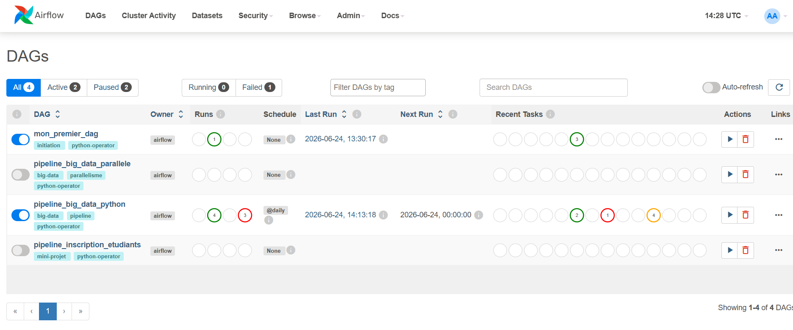

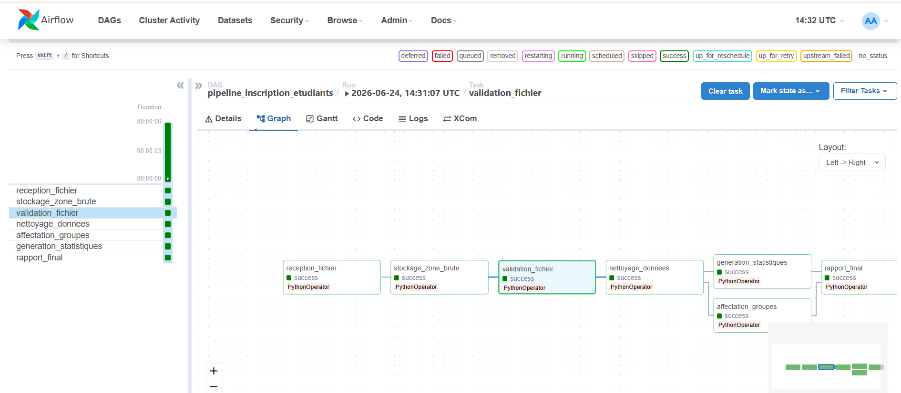

---

## 6. Réponses aux questions du TP

### Questions sur `pipeline_big_data_python`

**1. Quelle est la première tâche exécutée ?**

La première tâche exécutée est `ingestion_donnees`. Elle est définie en tête de la chaîne de dépendances :
```
ingestion >> stockage >> validation >> transformation >> traitement >> chargement >> rapport
```

**2. Quelle est la dernière tâche exécutée ?**

La dernière tâche exécutée est `generation_rapport`. Elle s'exécute en dernier et produit le fichier `rapport_pipeline.txt` contenant le chiffre d'affaires par ville.

**3. Quelle tâche crée le fichier CSV brut ?**

C'est la tâche `ingestion_donnees`. Elle génère le fichier `ventes_raw.csv` avec 6 lignes de données de ventes simulées pour les villes de Casablanca, Rabat, Marrakech et Tanger.

**4. Quelle tâche vérifie le schéma des données ?**

C'est la tâche `validation_donnees`. Elle lit l'en-tête du fichier `ventes_raw.csv` et vérifie que les colonnes correspondent exactement à `["id_vente", "ville", "produit", "prix", "quantite"]`. Si ce n'est pas le cas, elle lève une `ValueError`.

**5. Quelle tâche calcule le chiffre d'affaires par ville ?**

C'est la tâche `traitement_analytique`. Elle lit le fichier `ventes_clean.csv`, calcule la somme des montants par ville, et écrit le résultat dans `resultats_ventes.json`.

**6. Où peut-on voir les messages affichés par les fonctions Python ?**

Les messages affichés par `print()` sont visibles dans les **logs de chaque tâche** dans l'interface Web Airflow. Pour y accéder : cliquer sur le DAG → sélectionner un run → cliquer sur la tâche dans la vue Graph → onglet **Logs**.

---

### Questions sur `pipeline_big_data_parallele`

**1. Quelles tâches sont exécutées avant le parallélisme ?**

Deux tâches s'exécutent en séquence avant le parallélisme : `preparation_donnees` en premier, puis `validation_donnees`.

**2. Quelles tâches peuvent s'exécuter en parallèle ?**

Les tâches `traitement_par_ville` et `traitement_par_produit` s'exécutent en parallèle. Elles lisent toutes les deux le fichier `ventes_clean.csv` et produisent leurs résultats de manière indépendante et simultanée.

**3. Quelle tâche attend la fin des deux traitements ?**

C'est la tâche `generation_rapport_final`. Elle attend que `traitement_par_ville` **et** `traitement_par_produit` soient toutes les deux terminées avant de lire leurs fichiers de résultats et de générer le rapport final.

**4. Comment le parallélisme est-il représenté dans la vue Graph ?**

Les deux tâches parallèles (`traitement_par_ville` et `traitement_par_produit`) apparaissent sur le même niveau horizontal dans la vue Graph. Deux flèches partent de `validation_donnees` vers chacune des deux tâches, puis deux flèches convergent vers `generation_rapport_final`. Cette structure en fourche est la représentation visuelle du parallélisme dans Airflow.

---

## 7. Comprendre les logs

Les logs permettent de comprendre ce qui s'est passé pendant l'exécution d'une tâche. Les messages affichés par `print()` dans les fonctions Python apparaissent dans les logs de chaque tâche.

Pour consulter les logs d'une tâche : DAG → run → tâche → onglet **Logs**.

Vérification des messages pour chaque tâche du DAG `pipeline_big_data_python` :

| Tâche | Message attendu dans les logs |
|---|---|
| `ingestion_donnees` | `Ingestion terminee. Fichier cree : /opt/airflow/data/ventes_raw.csv` |
| `stockage_zone_brute` | `Stockage zone brute termine.` et `Taille : {X} octets` |
| `validation_donnees` | `Validation terminee avec succes.` et colonnes détectées |
| `transformation_donnees` | `Transformation terminee.` |
| `traitement_analytique` | `Traitement analytique termine.` et CA par ville |
| `chargement_resultats` | `Chargement termine.` |
| `generation_rapport` | `Rapport genere.` |


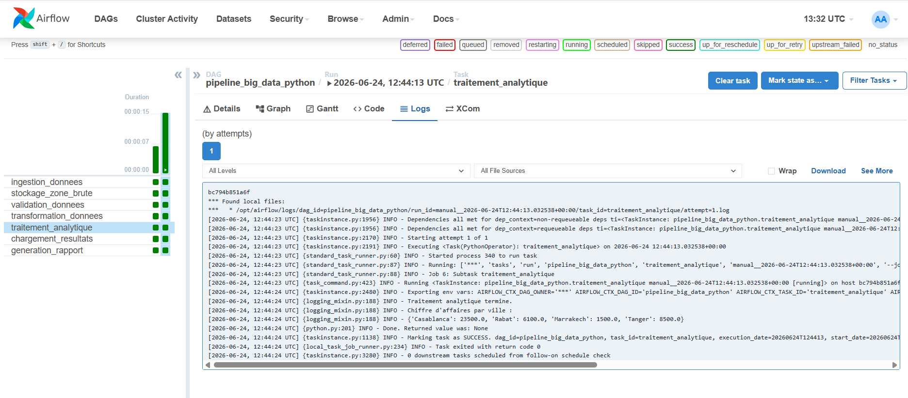

---

## 8. Planification automatique — `schedule="@daily"`

Par défaut, les DAGs utilisent `schedule=None` (déclenchement manuel uniquement).

Pour exécuter automatiquement un DAG chaque jour :
```python
schedule="@daily"
```

Pour exécuter un DAG toutes les heures :
```python
schedule="@hourly"
```

Pour exécuter un DAG tous les jours à 2h du matin :
```python
schedule="0 2 * * *"
```

Le DAG `pipeline_big_data_python` a été modifié pour utiliser `schedule="@daily"`. Après modification, l'interface Airflow affiche la prochaine exécution planifiée dans la colonne **Next Run**.

> Remarque : après modification d'un fichier DAG, Airflow peut prendre quelques secondes avant de détecter les changements.

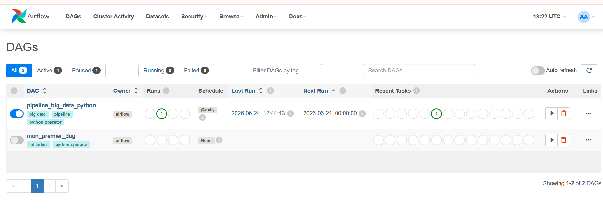

---

## 9. Erreur volontaire et gestion des erreurs

### 9.1 Provoquer une erreur

Avec PythonOperator, on peut provoquer une erreur avec l'instruction :
```python
raise Exception("Message d'erreur")
```

La fonction `validation_donnees` a été modifiée temporairement comme suit :
```python
def validation_donnees():
    raise Exception("Erreur volontaire : les donnees ne sont pas valides.")
```

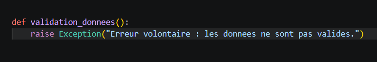

### 9.2 Observation dans Airflow

Après déclenchement du DAG :
- La tâche `validation_donnees` apparaît en **rouge** (failed) dans la vue Graph
- Les tâches suivantes (`transformation_donnees`, `traitement_analytique`…) ne s'exécutent pas
- L'onglet **Logs** de la tâche échouée affiche le message de l'exception

### 9.3 Interprétation

Si une tâche échoue, les tâches suivantes qui en dépendent ne s'exécutent pas. Exemple :

```
ingestion → validation → transformation
```

Si `validation` échoue, alors `transformation` ne s'exécute pas.

Étapes réalisées :
1. Modification temporaire de la fonction `validation_donnees`
2. Sauvegarde du fichier
3. Déclenchement du DAG
4. Observation de la tâche en erreur dans la vue Graph
5. Consultation des logs de la tâche échouée
6. Correction de la fonction
7. Relancement du DAG

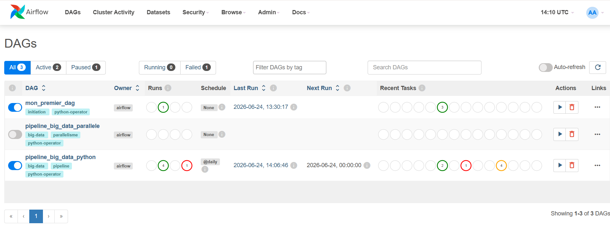

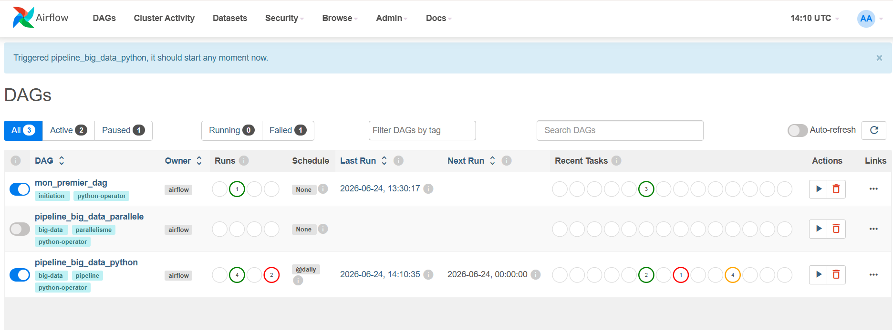

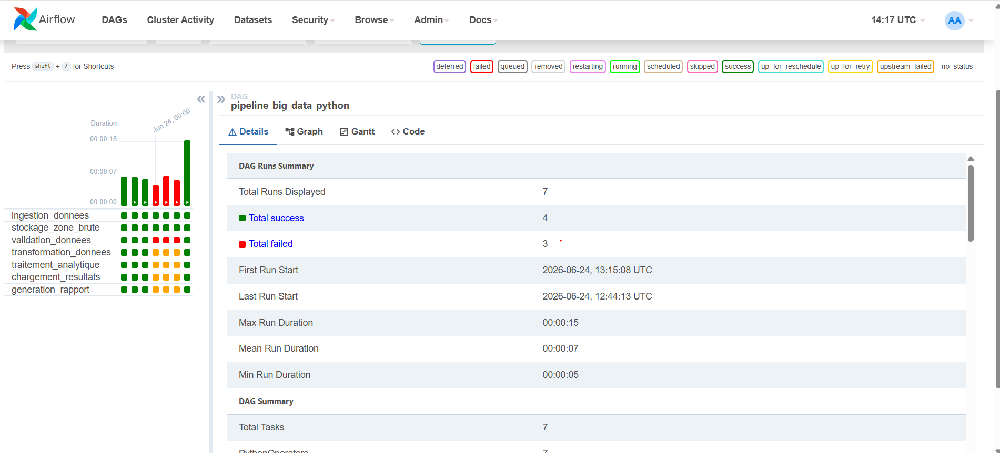

---

## 10. Retries — Relancer automatiquement une tâche

Dans certains cas, une tâche peut échouer temporairement :
- serveur indisponible
- fichier pas encore arrivé
- problème réseau
- base de données momentanément indisponible

Airflow peut relancer automatiquement une tâche grâce aux retries, configurés dans `default_args` :

```python
from datetime import timedelta

with DAG(
    dag_id="pipeline_big_data_python",
    start_date=pendulum.datetime(2026, 1, 1, tz="UTC"),
    schedule=None,
    catchup=False,
    default_args={
        "retries": 2,
        "retry_delay": timedelta(minutes=1),
    },
    tags=["big-data", "python-operator"],
) as dag:
```

| Paramètre | Valeur | Signification |
|---|---|---|
| `retries` | `2` | Nombre maximal de nouvelles tentatives en cas d'échec |
| `retry_delay` | `timedelta(minutes=1)` | Délai d'attente entre deux tentatives |

Dans la vue Graph, une tâche en cours de retry apparaît en jaune orangé (`up_for_retry`).

---

## 11. Captures d'écran

### 11.1 Lancement de l'environnement Docker


### 11.2 Interface de connexion Airflow


### 11.3 Liste des DAGs — `mon_premier_dag` détecté


### 11.4 Déclenchement de `mon_premier_dag`


### 11.5 Vue Graph — `mon_premier_dag` (succès)


### 11.6 Liste des DAGs — 2 DAGs visibles


### 11.7 Déclenchement de `pipeline_big_data_python`


### 11.8 Vue Graph — `pipeline_big_data_python` en cours


### 11.9 Logs Docker — webserver et scheduler

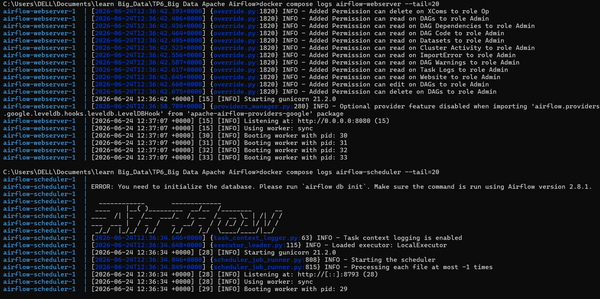

### 11.10 Logs de la tâche `traitement_analytique`


### 11.11 Fichier `rapport_pipeline.txt` généré


### 11.12 Fichier `resultats_ventes.json` généré


### 11.13 DAG avec planification `@daily`


### 11.14 Liste des DAGs — 3 DAGs dont `pipeline_big_data_parallele`

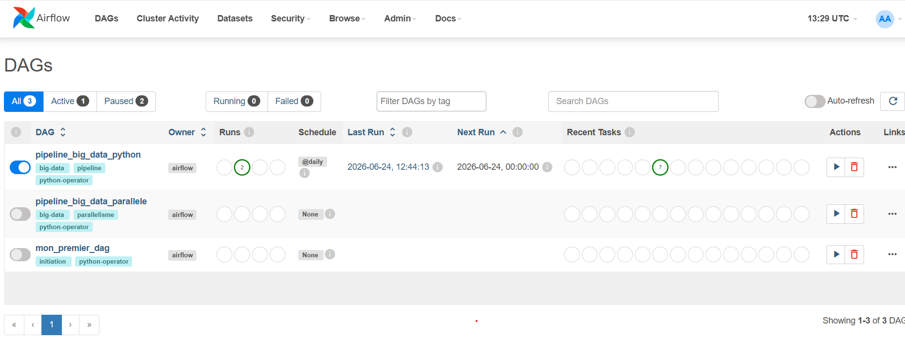

### 11.15 Vue Graph — `pipeline_big_data_python` (succès complet)


### 11.16 Logs détaillés de `traitement_analytique`


### 11.17 Run en échec après erreur volontaire


### 11.18 Nouveau run après correction


### 11.19 Résumé des exécutions — 4 succès, 3 échecs


### 11.20 Code de l'erreur volontaire


### 11.21 Liste des 4 DAGs complets


### 11.22 Vue Graph — `pipeline_inscription_etudiants` (succès)


---

## 12. Conclusion

Cet atelier a permis de comprendre et de mettre en pratique Apache Airflow comme outil d'orchestration de pipelines Big Data. En partant d'un simple DAG à 3 tâches, nous avons progressivement construit un pipeline complet de traitement de données de ventes comprenant l'ingestion, la validation, la transformation, l'analyse et la génération de rapports.

Les points clés acquis :

- déploiement d'Airflow via Docker Compose avec PostgreSQL comme backend
- création de DAGs en Python avec PythonOperator pour des pipelines séquentiels et parallèles
- consultation des logs pour vérifier l'exécution de chaque tâche
- gestion des erreurs avec `raise Exception` et observation de la propagation `upstream_failed`
- planification automatique avec `schedule="@daily"`
- implémentation du parallélisme avec la syntaxe `[tache_A, tache_B]`
- configuration des retries avec `default_args`

---

> **Technologies utilisées :** Apache Airflow 2.8.1 · Python 3.8 · Docker · PostgreSQL 13 · Docker Compose

